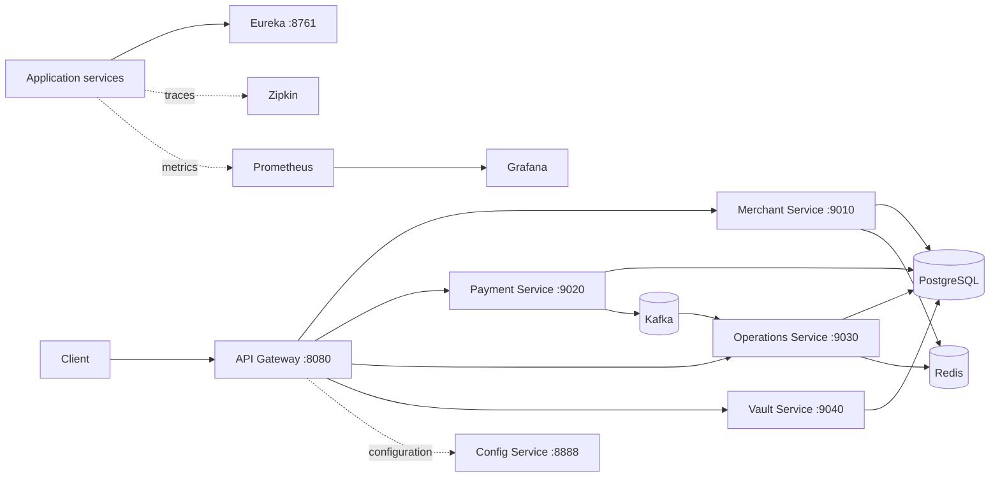

# Distributed Payment Platform

A microservices payment-platform project built with Java and Spring Boot. It explores the engineering behind payment lifecycles: safe retries, explicit state transitions, asynchronous event handling, merchant webhooks, and protected card data.

> **Scope:** This is a portfolio and learning project. Payment processing is simulated; it does not connect to a real bank or payment network and is not production-ready.

## At A Glance

- Eight Maven modules: seven services and a shared library.
- Payment initiation supports an idempotency key; lifecycle changes are validated and recorded.
- Payment events are written to an outbox and consumed asynchronously for merchant webhook delivery.
- Webhook delivery includes signatures, scheduled retries, and dead-letter recording.
- Vault tokenization encrypts card data and wraps a per-card data-encryption key.
- Kubernetes manifests target a local kind cluster, with Prometheus, Grafana, and Zipkin instrumentation.

## Architecture



| Module | Responsibility | Port |
| --- | --- | ---: |
| `api-gateway-service` | Public entry point, request routing, and security filters | 8080 |
| `merchant-service` | Merchant identity, API keys, and webhook configuration | 9010 |
| `payment-service` | Orders, payment authorization, capture, and lifecycle | 9020 |
| `operations-service` | Settlements and asynchronous webhook delivery | 9030 |
| `vault-service` | Card tokenization and simulated payment processing | 9040 |
| `config-service` | Centralized configuration from a Git repository | 8888 |
| `discovery-service` | Eureka service registry | 8761 |
| `common-lib` | Shared domain types, DTOs, and utilities | Library |

## Engineering Highlights

### Reliable payment lifecycle

Payment initiation accepts an optional `X-Idempotency-Key`, scoped to a merchant, so a retried request can return its existing attempt. A dedicated state machine validates payment transitions, and transition records capture the event, actor, and resulting status. Database row locks protect sensitive concurrent updates such as capture.

### Asynchronous events and webhooks

Payment status events are persisted through an outbox publisher. The operations service consumes Kafka events, resolves each merchant's configured destinations, signs webhook payloads, and schedules delivery through Redis. Failed deliveries can be retried; exhausted or invalid events are recorded for dead-letter investigation.

### Card-data protection

The vault returns a token instead of exposing stored card data. Card numbers are encrypted with AES-GCM using a per-card data-encryption key, and that key is itself encrypted before persistence. The payment processor in this repository is a simulator, intended for exercising service boundaries and failure paths.

### Distributed-system visibility

The repository includes Prometheus metrics, Grafana dashboards, and Zipkin tracing configuration, alongside service discovery and centralized configuration. Kubernetes manifests and a kind cluster configuration make the deployment topology inspectable and runnable locally.

## Technology

- Java 25, Spring Boot 4.1, and Spring Cloud
- Spring Cloud Gateway, Config Server, and Netflix Eureka
- PostgreSQL, Redis, and Apache Kafka
- Resilience4j
- Docker, Kubernetes, Kustomize, and kind
- Prometheus, Grafana, and Zipkin

## Build And Test

Install JDK 25. Each module is a separate Maven project with a wrapper. From PowerShell, for example:

```powershell
cd payment-service
.\mvnw.cmd test
```

Run the same command from any service module or `common-lib`. To package a module, run `..\mvnw.cmd package` from that module directory. `common-lib` is a library and does not run as a service.

Running the services also requires reachable infrastructure and configuration. Start the config and discovery services, configure the config server's Git repository, and provide database, Redis, and Kafka settings through your local environment. Do not commit credentials.

## Run On Kubernetes

Prerequisites: Docker, kind, and `kubectl`. From the repository root:

```powershell
kind create cluster --config k8s/kind-config.yaml
```

Kustomize reads `k8s/k8s-secrets.env` to generate the `app-secrets` Secret. Create that ignored local file with fresh values for the following keys:

```text
GIT_USERNAME
GIT_PASSWORD
GIT_CONFIG_REPO
JWT_SECRET
WEBHOOK_SECRET_ENCRYPTION_KEY
POSTGRES_PASSWORD
MERCHANT_DB_PASSWORD
PAYMENT_DB_PASSWORD
OPERATIONS_DB_PASSWORD
VAULT_DB_PASSWORD
VAULT_MASTER_KEY
GRAFANA_ADMIN_PASSWORD
```

Apply the manifests and inspect the workloads:

```powershell
kubectl apply -k k8s
kubectl get pods -n razorpay-core
```

The gateway is mapped to <http://localhost:8080>. The manifests reference published container images; build and load images into kind and update the references under `k8s/services/` to run local code changes.

For local observability without Kubernetes, start the compose stack:

```powershell
docker compose -f observability/docker-compose.yml up -d
```

For Kubernetes port forwards, run each command in a separate terminal:

```powershell
kubectl port-forward -n razorpay-core svc/zipkin 9411:9411
kubectl port-forward -n razorpay-core svc/prometheus 9090:9090
kubectl port-forward -n razorpay-core svc/grafana 3000:3000
kubectl port-forward -n razorpay-core svc/kafka-ui 8090:8090
```

Then open Zipkin at <http://localhost:9411>, Prometheus at <http://localhost:9090>, Grafana at <http://localhost:3000>, or Kafka UI at <http://localhost:8090>.

## Repository Layout

```text
api-gateway-service/  Public API gateway
merchant-service/    Merchant and webhook configuration
payment-service/     Orders and payment lifecycle
operations-service/  Settlements and webhook delivery
vault-service/       Card tokenization and processor simulator
config-service/      Centralized configuration
discovery-service/   Service registry
common-lib/           Shared domain code
k8s/                  kind and Kubernetes manifests
observability/        Local Prometheus/Grafana/Zipkin stack
```

## Security And Limitations

- Never commit `k8s/k8s-secrets.env`, access tokens, passwords, or production keys. Revoke and rotate credentials that may have been exposed.
- The manifests and default settings are for local development. Review authentication, secret management, network policy, persistence, and resource limits before any shared deployment.
- The payment processor is simulated. This project does not implement real payment-network connectivity or claim production compliance.